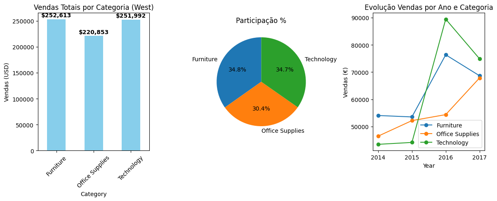

# 💼 Data Analyst Portfolio

**Projetos semanais de análise de dados para transição de carreira.**

## 📊 Projetos Completos

### **🚀 Semana 1: Superstore West**

### **🦠 Semana 2:. Dashboard Tuberculose Mundial (Streamlit + Plotly)**

Dashboard interativo para análise da evolução da tuberculose por país.

**Funcionalidades:**
- Filtros por país
- KPIs de incidência
- Gráficos de tendência temporal
- Status de controle por país

### **🦠 Semana 3:. Artigo no LinkedIn**
[Como os princípios da Arquivologia (Proveniência, Unicidade, Organicidade...) se aplicam a bancos de dados e análise moderna?](https://www.linkedin.com/pulse/arquivologia-na-era-dos-dados-princ%C3%ADpios-antigos-para-osvaldo-okmxe/)]

### **🏨 Semana 4:. Dashboard Tuberculose Mundial (Streamlit + Plotly)**
### Semana 4: Hotel Bookings - Revenue Management
**Análise 119k reservas (2015-2017)**  
- Resort 28% vs City 42% cancelamentos  
- Agosto 49% pico sazonal  
- Lead time >90 dias = 61% risco  
- 4 visuais PNG + insights acionáveis  
